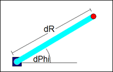
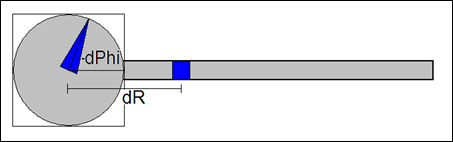

# Polar System

Polar systems consist of a rotational axis (direction) and a linear axis (distance).

The origin and the direction of the linear axis can be changed by means of the offsets `dPhi` and `dR`.

For more information, see: [SMC\_TRAFO\_Polar (FB)](../../../../../../api/crossBook?lang=en-US&virtualBookName=SM3_CNC&topicID=SMC_TRAFO_Polar) and [SMC\_TRAFOF\_Polar (FB)](../../../../../../api/crossBook?lang=en-US&virtualBookName=SM3_CNC&topicID=SMC_TRAFOF_Polar)

15.0

© Copyright 2026, CODESYS GmbH