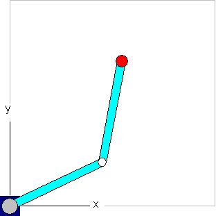

# 2-Jointed SCARA System

The **Selective Compliance Assembly Robot Arm** (SCARA) is a special type of industrial robot that is similar to a human arm. A SCARA system has two axes and two degrees of freedom. The movement is restricted to the X/Y plane.

For more information, see: [SMC\_TRAFO\_Scara2 (FB)](../../../../../../api/crossBook?lang=en-US&virtualBookName=SM3_CNC&topicID=SMC_TRAFO_Scara2) and [SMC\_TRAFOF\_Scara2 (FB)](../../../../../../api/crossBook?lang=en-US&virtualBookName=SM3_CNC&topicID=SMC_TRAFOF_Scara2)

15.0

© Copyright 2026, CODESYS GmbH