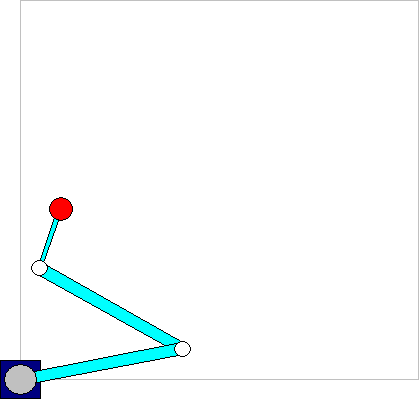

# 3-Jointed SCARA System

The 3-jointed SCARA system has a third axis which allows movement at a constant direction. As in 2-jointed systems, the movement is restricted to the X/Y plane.

For more information, see: [SMC\_TRAFO\_Scara3 (FB)](../../../../../../api/crossBook?lang=en-US&virtualBookName=SM3_CNC&topicID=SMC_TRAFO_Scara3) and [SMC\_TRAFOF\_Scara3 (FB)](../../../../../../api/crossBook?lang=en-US&virtualBookName=SM3_CNC&topicID=SMC_TRAFOF_Scara3)

15.0

© Copyright 2026, CODESYS GmbH