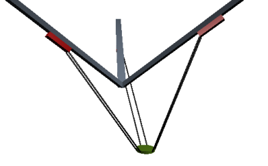

# Tripod with linear axes

This system has three linear drives that are in a defined angle to each other. The drives consist of 3 rails with traversing slides. The tool plate is connected to the traversing slides by connecting rods of the same length. A paired set of connecting rods holds the tool plate parallel to the floor in the same orientation. The kinematics can move the tool plate in three dimensions.

The forward and inverse transformation of these kinematics is calculated in the `SMC_Trafo_Tripod_Lin` and `SMC_TrafoF_Tripod_Lin` POUs. The axis angle of the tripod is defined by the angle between the rail and the vertical axis (`dAxisAngle`).

**Mechanical requirements and coordinate system**

* The lengths of the 3 axes are identical.
* The lengths of the connecting rods are identical.
* The distance between the pairs of connecting rods to each other is identical for all pairs.
* The axis angle between drive rails and the vertical axis is identical for all three drives. The angle allowance is between 0° and 90°.
* The axis defines the movement of the point between the connecting rod joints on the sliders.
* The XYZ coordinate system is right-handed. The X and Y vectors are horizontal and Z points up. The origin is defined so that the intersections of the three movement axes with the XY plane (graphics below: points A) is on a circle at position [0,0,0].

Parameterization of the SMC\_TrafoF\_Tripod\_Lin function block

| Name | Description |
| --- | --- |
| `dInnerRadius` | Distance from the center of the tool plate to the gripping points of the connecting rods |
| `dOuterRadius` | Point A is the intersection of the axis with the XY plane. |
| `dLength` | Length of the connecting rods |
| `dDistance` | Distance between the two connecting rods in one pair |
| `dRotationOffset` | Point A of the first axis defines the X-axis by default. The offset is used to rotate the entire structure about the Z-axis. In this case, point A is no longer on the X-axis. |
| `dOffsetA` | The offset is used to set the positional value of the axis to its default setting of zero. |
| `dOffsetB` |  |
| `dOffsetC` |  |
| You will find information about other parameters in the library description. | |

15.0

© Copyright 2026, CODESYS GmbH