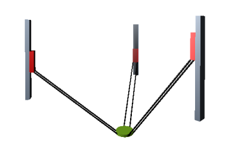

# Tripod with vertical axes

This system is a special variant of the kinematic design described above and has the same mechanical requirements. The angle `dAxisAngle` between the guide rails and the vertical axis is 0° and the guide rails are parallel to the vertical axis.

The forward and inverse transformation of these kinematics is calculated in the `SMC_Trafo_Tripod_Lin` and `SMC_TrafoF_Tripod_Lin` function blocks. The axis angle of the tripod is defined by the angle between the rail and the vertical axis (`dAxisAngle`).

Parameterization of the SMC\_TrafoF\_Tripod\_Lin function block

| Name | Description |
| --- | --- |
| `dInnerRadius` | The parameter defines the radius of the circle that is described by the six gripping points of the connecting rods to the tool plate. |
| `dOuterRadius` |  |
| `dLength` | Length of the connecting rods |
| `dDistance` | Distance of the pairs of connecting rods to each other |
| `dRotationOffset` | Point A of the first axis defines the X-axis by default. The offset is used to rotate the entire structure about the Z-axis. In this case, point A is no longer on the X-axis. |
| `dOffsetA` | The offset is used to set the positional value of the axis to its default setting of zero. |
| `dOffsetB` |  |
| `dOffsetC` |  |
| You will find information about other parameters in the library description. | |

15.0

© Copyright 2026, CODESYS GmbH