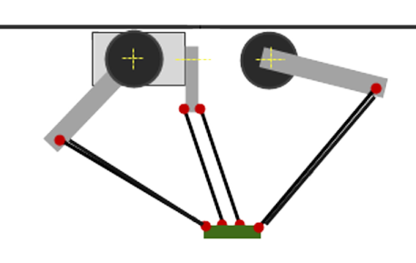
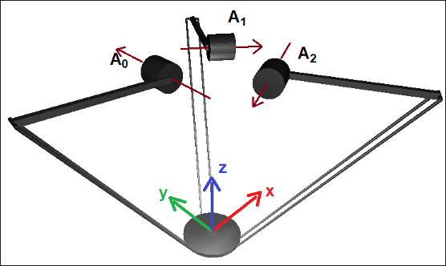
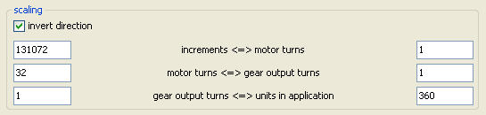
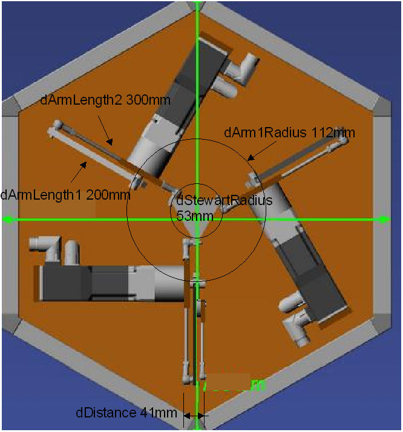

# Tripod with rotary axes

For tripods, the kinematics are implemented by 3 rotary drives that are connected to the tool plate by arms and connecting rods.



The origin of the coordinate system is the location of the center of the tool plate when all 3 arms are in a horizontal position.

The forward and inverse transformation of these kinematics is calculated in the `SMC_TRAFO_Tripod_Arm` and `SMC_TRAFOF_Tripod_Arm` function blocks.

**Mechanical requirements and coordinate system**

* The lengths of the three axes are identical.
* The lengths of the connecting rods are identical.
* The distance between the pairs of connecting rods to each other is identical for all pairs.

Parameterization of the SMC\_TrafoF\_Tripod\_Arm function block

| Name | Description |
| --- | --- |
| `dArmLength1` |  |
| `dArmLength2` |  |
| `dArm1Radius` | The parameter defines the radius of the circle that is established by the 3 points P of the drives. |
| `dStewartRadius` | The parameter defines the radius of the circle that is described by the 6 gripping points of the connecting rods to the tool plate. |
| `dDistance` | Distance between the two connecting rods in one pair |
| `dOffsetA` |  |
| `dOffsetB` |  |
| `dOffsetC` |  |
| You will find information about other parameters in the library description. | |

The image shows the zero position of all axes. (The three upper arms are horizontal.) The MCS is shown at the tool plate. The arrows on the A0, A1, and A2 axes show the direction of rotation of the drives according to the right-hand rule.



|  |  |
| --- | --- |
| Machine Coordinate System (MCS) | |
| Origin | Defined in the midpoint of the tool plate when all 3 upper arms (those that are connected directly with A0, A1, or A2) are in a horizontal position |
| X | From the origin, points away from the first motor (A0), parallel to the upper arm segment of the first arm |
| Y | Determined by X and Z so that the MCS is right-handed |
| Z | Orthogonal to the tool plate  Points from the tool plate in the direction of the motors |

The respective transformations are executed by the following POUs `SMC_TRAFO_Tripod_Arm` and `SMC_TRAFOF_Tripod_Arm`:

**Example: 3S tripod**

Transformation settings

```
tta:
SMC_TRAFO_Tripod_Arm := (dArmLength1:=200, dArmLength2:=300, dArm1Radius:=112, dStewartRadius:=53,dDistance:=41,dMaxAngleBallJoint:=60);
ttaf:
SMC_TRAFOF_Tripod_Arm := (dArmLength1:=200, dArmLength2:=300, dArm1Radius:=112, dStewartRadius:=53,dDistance:=41);
```





15.0

© Copyright 2026, CODESYS GmbH