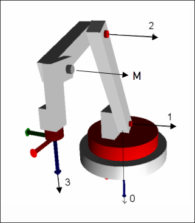

# Definition of axes

The following image shows the rotational direction of the four axes. The black arrows run along the joint axis. The rotational direction is determined according to the right-hand rule: If the thumb of the right hand points downwards along the arrow, then the positive rotational direction is in the direction of the slightly curved finger. For example, when viewed from above, the positive direction of rotation of axis 0 is clockwise, while axes 1 and 2 tilt "forwards" for positive rotation.

The kinematics are provided with four controlled rotary axes (see red colored axes a0, a1, a2, a3) and a fifth mechanical rotary axis (see gray colored axis M).

**Value ranges of the axes:**

* Axis 0: ]-180°, 180°[
* Axis 1: [-90°, 90°]
* Axis 2: [-180°, 90[
* Axis M: Mechanical rotary axis. No restriction
* Axis 3: Unrestricted; the range can also be greater than 360°

15.0

© Copyright 2026, CODESYS GmbH