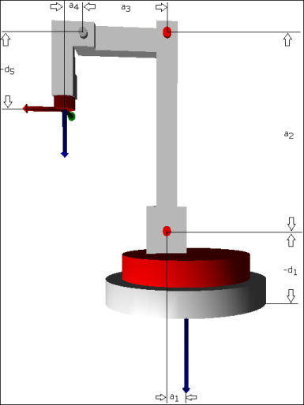

# Zero position and dimensions

The image shows the kinematics in zero position of all axes. In the zero position, the axes of the tool coordinate system run parallel to those of the machine coordinate system. Specify the indicated dimensions in the configuration structure `SMC_TrafoConfig_4AxisPalletizer` Also specify all `a_i` with positive signs and all `d_i` with negative signs. The names of the parameters are according to the Denavit-Hartenberg convention.

Denavit–Hartenberg transformation of joints

|  | Joint offset (sigma\_i) | Joint distance (d\_i) | Arm element length (a\_i) | Torsion (alpha\_i) |
| --- | --- | --- | --- | --- |
| 1 | 0° | d\_1 | a\_1 | 90° |
| 2 | -90° | 0 | a\_2 | 0° |
| 3 | 90° | 0 | a\_3 | 0° |
| 4 | 0° | 0 | a\_4 | 90° |
| 5 | 0° | d\_5 | 0 | 180° |

15.0

© Copyright 2026, CODESYS GmbH