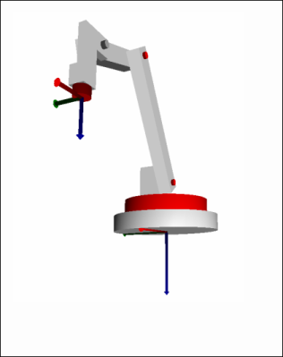

# 4-Axis Palletizer Kinematics

The 4-axis palletizer kinematics is a general robot type that is used frequently for palletizing tasks. The kinematics are provided with four controlled rotary axes (marked in red) and a fifth mechanical rotary axis (marked in gray). The `SMC_Trafo_4AxisPalletizer` and `SMC_TrafoF_4AxisPalletizer` POUs implement its forward and inverse transformation.

The Cartesian coordinate system is the basis for the palletizer. The Z axis points downwards perpendicularly and the X axis "forwards", which means in the direction that the arm points in the zero direction of the axes. The origin of the Cartesian coordinate system is the intersection of the joint axis 1 and the underside of the robot.

15.0

© Copyright 2026, CODESYS GmbH