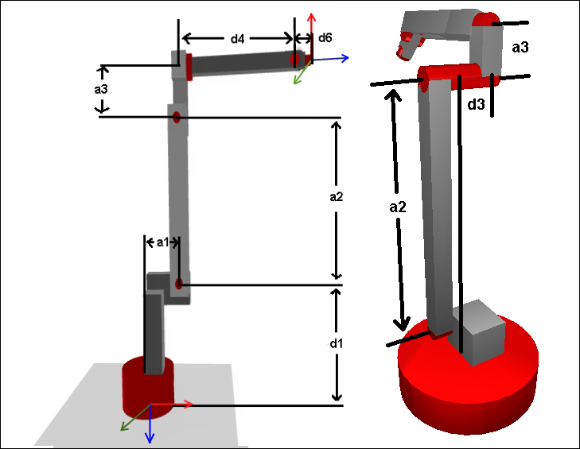

# Homing position and dimensions

The image on the left shows the homing position of the kinematics, which is the position where all axes are in their zero position. Specify the indicated dimensions in the configuration structure `SMC_TrafoConfig_ArticulatedRobot_6DOF`. The names and signs of the parameters are in accordance with the Denavit–Hartenberg convention. The image on the right shows the additional Denavit–Hartenberg parameter `d3`.

**Note:**

* a1, a3, d4, and d6 have to be >= 0
* a2 has to be > 0 (> `g_fSMC_CNC_EPS`)
* d1 has to be <= 0

Denavit–Hartenberg transformation of joints

|  | Joint Offset (sigma\_i) | Lever Offset (d\_i) | Lever Length (a\_i) | Lever Rotation (alpha\_i) |
| --- | --- | --- | --- | --- |
| 1 | 0° | d1 | a\_1 | -90° |
| 2 | 90° | 0 | a\_2 | 0° |
| 3 | 0° | d3 | a\_3 | 90° |
| 4 | 0° | d4 | 0 | 90° |
| 5 | 0° | 0 | 0 | -90° |
| 6 | 0° | d6 | 0 | 0° |

15.0

© Copyright 2026, CODESYS GmbH