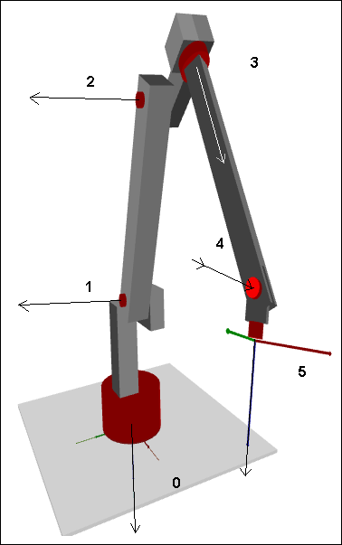

# 6-Axis Articulated Robot

Transformation of an articulated arm robot with six rotary axes and six degrees of freedom (DoF). The three orientation axes of the robot arm intersect at one point: the joint center.

The `SMC_Trafo_ArticulatedRobot_6DOF` and `SMC_TrafoF_ArticulatedRobot_6DOF` function blocks implement forward and inverse transformations of an articulated arm robot with six rotational axes. In the image, the Cartesian coordinate system is marked below at axis 0. The z-axis points downwards and the x-axis points forwards in the direction of the tool center point (TCP). The origin of the Cartesian coordinate system is the intersection axis 0 and the underside of the robot.

15.0

© Copyright 2026, CODESYS GmbH