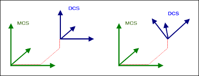

# MCS and DCS coordinate systems

The machine coordinate system (MCS) is defined by the applied kinematics which determine its position and orientation.

The decoder coordinate system (DCS) is managed by the interpreter (`SMC_NCInterpreter` function block instance). All coordinate information for motion commands are interpreted in this coordinate system. This affects the target position of a movement (`X/Y/Z`), as well as an arc midpoint (`I/J/K`) or a plane that is set with `G15/G16/G17/G18/G19`.

The DCS is programmed with the commands `G53/G54/G55/G56`. You can rotate, shift, and scale the DCS with respect to the machine coordinate system, and therefore adapt the position, orientation, and scaling in the G code file any number of times. You program the path elements relative to the DCS. For example, this can be an advantage for the same path elements in different positions and orientations.

The following image shows a shift (left) and a shift with rotation (right).

The interpreter gets the information from its `eOriConv` input about whether `A/B/C` are treated as additional axes or as orientation values. The coordinates of the path elements are transformed accordingly. Therefore, the interpreter function block manages an active coordinate system. Initially, if the DCS is neither shifted, nor rotated, nor scaled, then the DCS corresponds to the MCS. The start and target positions and the plane for arcs are specified in the generated GeoInfo objects always relative to the MCS.

|  |  |
| --- | --- |
| `SMC_NCInterpreter.eOriConf = SMC_ORI_CONVENTION.ADDAXES` | No orientation convention is specified. The contents of the G code word A/B/C is interpreted as an shift value. |
| `SMC_NCInterpreter.eOriConf = SMC_ORI_CONVENTION.ZYZ` | The orientation convention is the standard Y convention (Z, Y', Z''). The contents of the G code word A/B/C is interpreted as an angle value. |
| `SMC_NCInterpreter.eOriConf = SMC_ORI_CONVENTION.ZYX` | The orientation convention is the yaw-pitch-roll convention (Z, Y', X''). The contents of the G code word A/B/C is interpreted as an angle value. |
| `SMC_NCInterpreter.eOriConf = SMC_ORI_CONVENTION.XYZ` | The orientation convention is the XYZ convention (X, Y', Z''). The contents of the G code word A/B/C is interpreted as an angle value. |

15.0

© Copyright 2026, CODESYS GmbH