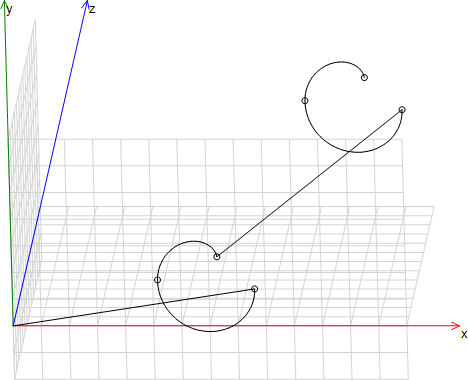

# Shifting the DCS

1. Set the `eOriConv` input of the `SMC_NCInterpreter` function block instance to `SMC_ORI_CONVENTION.ADDAXES`.

   * The DCS can be shifted. A rotation is not possible.
2. Program the CNC path. First, specify the position shift of the DCS.

   Example: `G54 X10 Y10 Z10 A30 B30 C30`

   * The X/Y/Z/A/B/C axes of the DCS are shifted.

**Example**

Absolute offset

```
N10 G0 X100 Y100 F100
N20 G54 X50 Y50    (Offset auf 50/50)
N30 G1 X0 Y0       (Fahrt nach 50/50)
N40 G54 X100 Y100  (Offset auf 100/100)
N50 G1 X0 Y0       (Fahrt nach 100/100)
N60 G53            (Offset auf 0)
N70 G1 X0 Y0       (Fahrt nach 0/0)
```

Current position as offset

```
N0 G0 X100 Y100 F100
N10 G56 X0 Y0  (Aktuelle Position 100/100 wird 0/0)
N20 G1 X10     (Fahrt nach 110/100)
N30 G56 X20 Y0 (Aktuelle Position 110/100 wird 20/0)
N40 G1 X0      (Fahrt nach 90/100)
```

Adapt offset by value

```
N0  G54 X10 Y20 Z30  U7 (Offset: X=10, Y=20, Z=30, U=7)
N10 G55 X-10 U7         (Offset: X=0, Y=20, Z=30, U=14)
```

Same path elements in two positions

```
N05 G17
N10 G54 X10 Y10 Z10
N20 G01 X6.574 Y-10 Z-1.961 I8.287 J-0.000
N30 G02 X-0.480 Y-10 Z0.008 I-3.527 J4.988E-05
N040 G02 X3.418 Y-9.806 Z4.482 I1.949 J0.097
N50 G55 X10 Y10 Z10
N60 G01 X6.574 Y-10 Z-1.961 I8.287 J-0.000
N70 G02 X-0.480 Y-10 Z0.008 I-3.527 J4.988E-05
N80 G02 X3.418 Y-9.806 Z4.482 I1.949 J0.097
```



15.0

© Copyright 2026, CODESYS GmbH