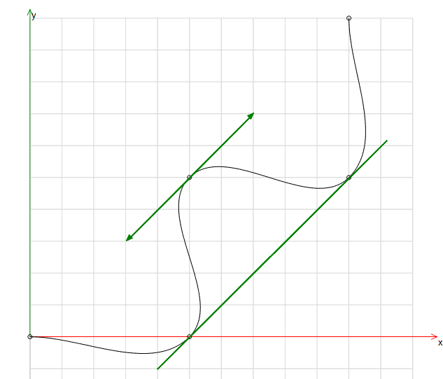
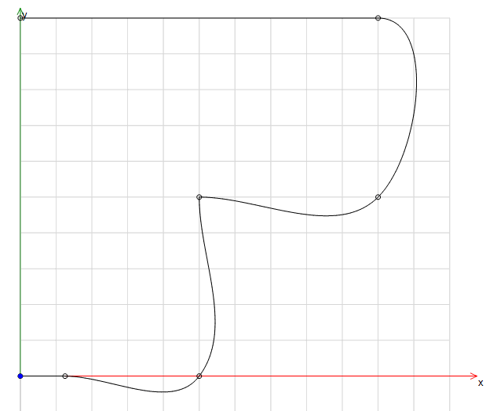

# Spline

**G code**: `G5`, `G10`

**Function**: The command interpolates the path element with a spline so that the transitions from the previous path element and to the next path element merge into each other without any breaks. At the same time, the spline segment from the system is calculated so that the end tangent of the previous path element agree with the start tangent of the spline. Likewise, the end tangent of the spline agree with the subsequent path element.

**Function**: The command creates a spline segment for the given position. The transitions from the previous path element and to the following path element are continuously in position and tangent.

Syntax

```
G5 X Y Z A B C P Q U V W F E H L/O D S
G10 X Y Z A B C P Q U V W F E H L/O D S
```

| G Code Word | Description |
| --- | --- |
| `X Y Z` | Target positions of the Cartesian axes |
| `A B C P Q U V W` | Target positions of the additional axes |
| `F E` | Path velocity, path acceleration/deceleration |
| `H L/O` | Switch point |
| `D` | Tool radius |
| `S` | S profile |

**Multiple consecutive spline segments are connected as follows:**

**Start tangent**

* If a path element with tool operation exists (example: G1, G2, G3, G8, G9), then the end tangent of the path element is used as the start tangent for the spline.
* If no path element is available with tool operation (e.g. G0, G92, M), then the connecting line between the starting point and the first spline point is used as a start tangent.

**Tangent in the middle of the spline**

* Adjacent points are connected. The tangent of the point is parallel to this connecting line (green line).

**End tangent**

* If a path element with tool operation exists (example: G1, G2, G3, G8, G9), then the start tangent of the path element is used as the end tangent for the spline.
* If no path element is available with tool operation (for example, G0, G92, M), then the connecting line between the end point and the first spline point is used as an end tangent.

**Examples**

**Staircase profile with splines rounded**

```
N0 G0 X0 Y0 Z0 F100 (Startposition)
N10 G5 X20 Y0
N20 G5 X20 Y20
N30 G5 X40 Y20
N40 G5 X40 Y40
```



**Profile rounded with double spline**

```
N0 G0 X0 Y0 F100 (Startposition)
N5 G1 X5 Y0
N10 G5 X20 Y0
N20 G5 X20 Y20
N21 G5 X20 Y20
N30 G5 X40 Y20
N40 G5 X40 Y40
N45 G1 X0 Y40
```



The spline point for X20 Y20 exists two times. In this way, the spline is interrupted and restarted. This is determined by the definition method of the tangent at this point. The start and end points are defined by the start tangents of the preceding and subsequent line segment.

15.0

© Copyright 2026, CODESYS GmbH