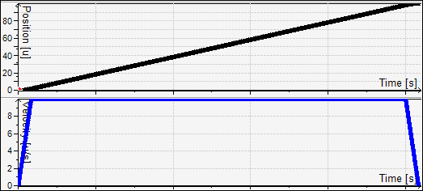
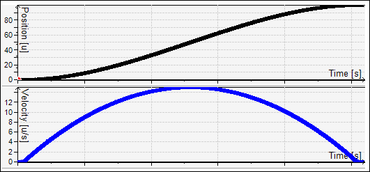
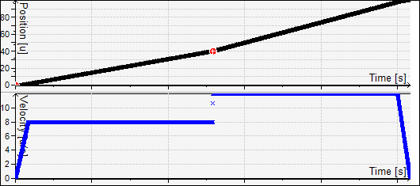
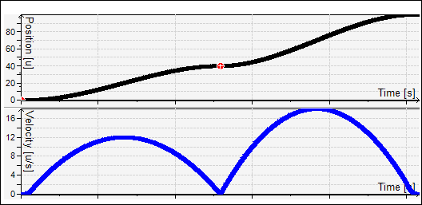
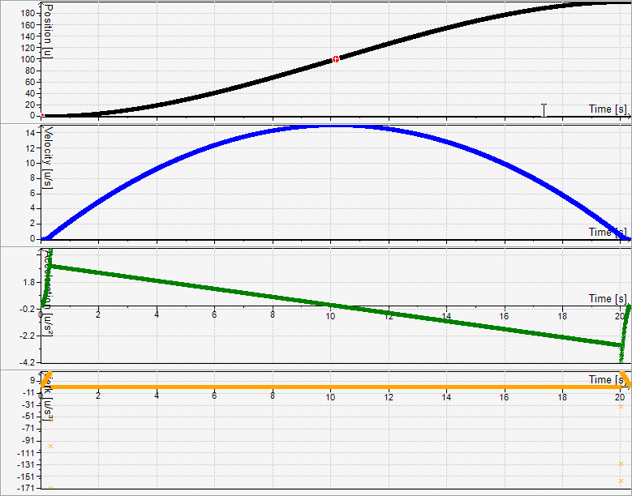

# Additional Spline Axes A, B, C

**G code word**: `A`, `B`, `C`

**Function**: Use `A`, `B`, and `C` to define the target positions for additional spline axes. These axes are similar to `P`, `Q`, `U`, `V`, and `W`. While `P`, `Q`, `U`, and `V` are interpolated linearly, `A`, `B`, and `C` are interpolated with a 3rd degree polynomial.

TIP:

* Using `A`, `B`, or `C` excludes the use of the additional axes `U`, `V`, and `W` because `U`, `V`, and `W` define the gradient.
* The axes `A`, `B`, or `C` can be selected with bits 3, 4, or 5 at the `wAxis` input of `SMC_LimitDynamics` or `wAddAxis` of `SMC_CheckForLimits`.
* The `SMC_SmoothPath`, `SMC_SmoothMerge`, `SMC_SmoothBSpline`, and `SMC_RecomputeABCSlopes` function blocks automatically determine the slope of the additional axes. This means that the definition of `U`, `V`, or `W` is not necessary.

**Example 1**

G Code

```
N10 G0 X0 A0 P0 F10 E30 E-30
N20 G1 X100 A100 P100
```

The linear additional axis P is interpolated linearly to the traveled path. Accordingly, its time profile returns that of the path velocity.



The additional spline axis A is interpolated as a polynomial function.



**Example 2**

Using the spline function is necessary, especially if a path with constant tangent transitions is used, which the interpolator does not have to decelerate to velocity 0:

G Code

```
N10 G0 X0 A0 P0 F10 E30 E-30
N20 G1 X50 A40 P40
N30 G1 X100 A100 P100
```

In the linear case, you see a jump in the velocity, because 40 units of the additional axis run on 50 path units in the first part, and 60 units of the additional axis run on 50 path units in the second part. Because the path velocity is defined only according to the path in Cartesian space (X Y Z), a constant velocity in X results in a velocity jump in P:



The spline axis displays the following profile:



**Example 3**

The slope of the axes A, B, and C at the end position can be defined by the U, V, and W word. The unit of the slope is the path unit of the additional axis per path unit in the space.

G Code

```
N10 G0 X0 A0 F10 E30 E-30
N20 G1 X100 A100 U1.5
N30 G1 X200 A200 U0
```

The user-programmed slope (U=2) of the A axis applies because this program contains a continuous transition between `N20` and `N30`. Therefore, for X=100 the position of the A axis increases two times as fast as the path length.



15.0

© Copyright 2026, CODESYS GmbH