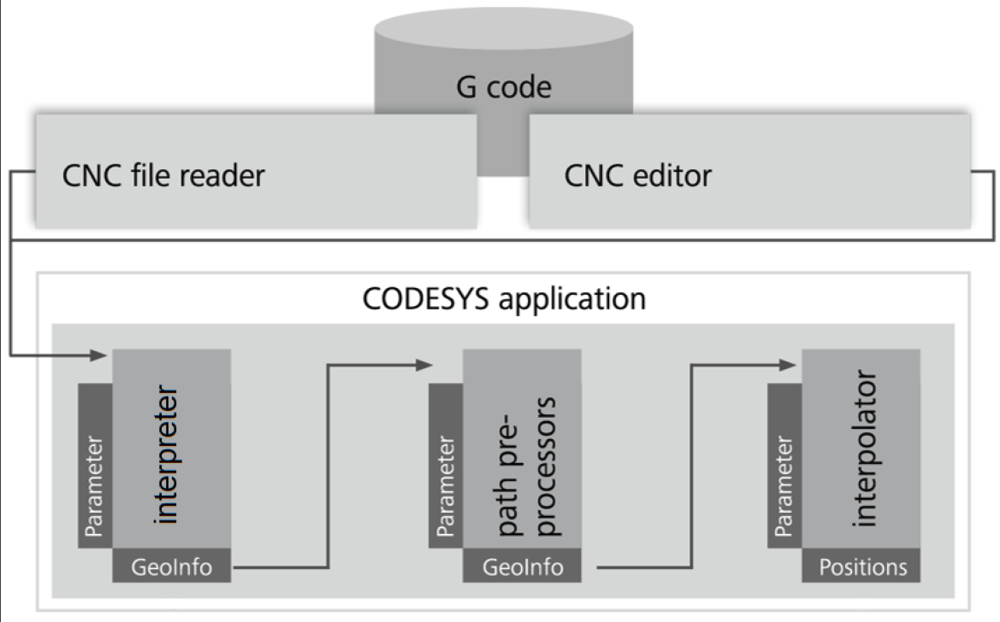

# Pipelining of G-code processing

When G-code is read from a file, it is often impractical to read and process the entire file before starting machining. For some applications, G-code files can have a few hundred thousand or even millions of lines. Reading all at once would take a long time and also require a lot of memory.

Instead, the G-code is read line by line, but only a small fraction (a few hundred lines) is kept in memory at each point in time. This part is kept in queues, i.e. in data structures which work according to the "first in, first out" principle: The producing function block adds elements to the queue. The consuming function block reads and removes elements in the same order they were inserted.

The diagram shows the flow of the G-code through the system. First, G-code is read from a file, then converted into so called GeoInfo elements by the interpreter. These elements are processed by the path preprocessing function blocks and finally interpolated. The parts marked by "GeoInfo" represent the queues. If more than one path preprocessor (such as `SMC_SmoothPath`, `SMC_ToolRadiusCorr`, or `SMC_AvoidLoop`) is used, then they are also connected by queues.

15.0

© Copyright 2026, CODESYS GmbH