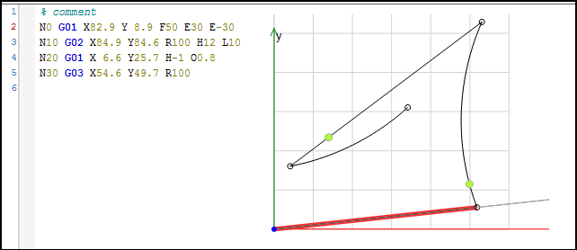

# Creating an NC program in the CNC editor

1. Create a `CNCdirect` project with a SoftMotion controller.
2. Specify the following motion blocks:

   * CNC editor:

     

15.0

© Copyright 2026, CODESYS GmbH