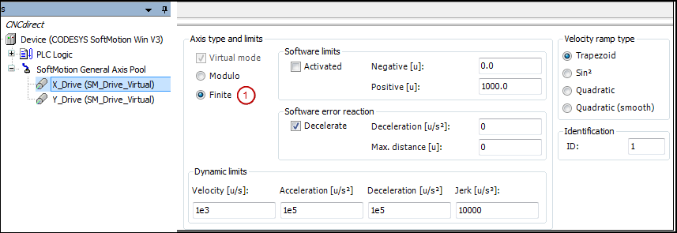

# Creating a drive interface and PLC configuration

Define a drive structure with two linear drives as follows:

1. Insert two virtual drives `X_Drive` and `Y_Drive` below the **SoftMotion general axis pool**.
2. Set the **Axis type** parameter to `Finite` (1).

   * Configuration editor:

     

15.0

© Copyright 2026, CODESYS GmbH