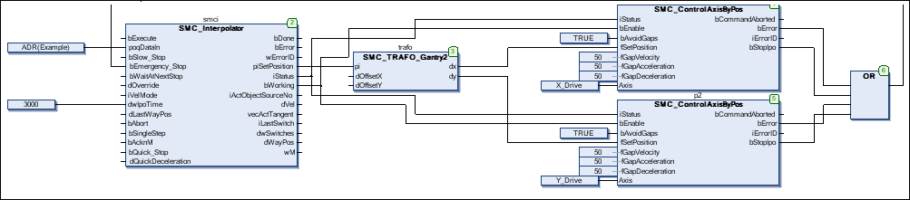

# Creating an IEC program

1. Add a new CFC program **Ipo** to the application and configure a cyclic task with an interval of 3 ms.
2. The outputs of the function block (the axis coordinates) have to be written to the drives. This is done with the `SMC_ControlAxisByPos` function block. Because the application does not guarantee that the outputs of the interpolator are constant (e.g. the path ends at a point other than where it began), activate the gap avoidance (`bAvoidGaps`, `fGapVelocity`, `fGapAcceleration`, and `fGapDeceleration`). Then connect the `StopIpo` output to the `bEmergency_Stop` input of the interpolator and connect interpolator output `iStatus` to the respective inputs of the axis control function blocks.

   Above all, pay attention to the correct order of function blocks when programming with CFC.

   * CFC:

     

15.0

© Copyright 2026, CODESYS GmbH