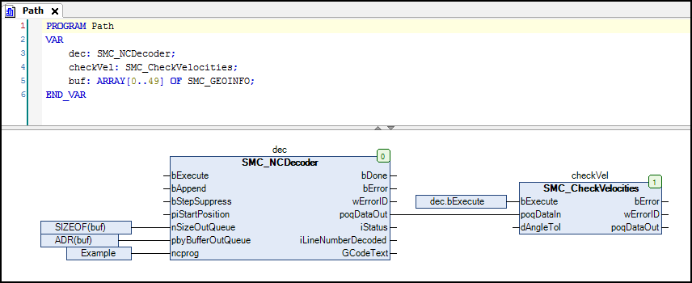

# Creating an IEC program

1. Add a POU (CFC) named `Path` to the application.

   The decoding of the NC program for OUTQUEUE and the velocity check take place in the `Path` program.

   Calling `SMC_CheckVelocities` is required.

   * CFC:

     
2. Add a POU (CFC) named `Ipo` to the application.

   This program is almost identical to the `CNCdirect` sample project. However, the data input of the interpolator does not correspond to the CNC program names (`ADR(Example)`), but to the OutQueue output of the path preprocessing function blocks (`checkVel.poqDataOut`).

15.0

© Copyright 2026, CODESYS GmbH