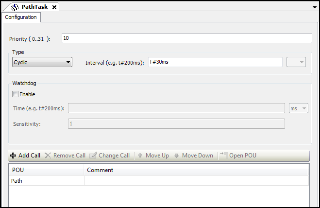

# Creating a task for path preprocessing

Because you have selected the compile mode `SMC_CNC_REF`, you have to perform decoding and path preprocessing in the IEC program. This calculation is time consuming. It does not have to be executed in the interpolator cycle because one path object is generated per decoder call, and this object is typically used for many interpolator calls. You should swap out this operation to a task with low priority and less frequent calls.

1. Create a `PathTask` task.
2. Add the `Path` POU to the task.

"PathTask" task 

**Underlying mechanism:**

* In the slow task, approximately one GEOINFO object is generated per cycle at first. This object is stored in the OUTQUEUE structure of the decoder function block. If the OUTQUEUE is full, then the function blocks of the slow task pause until the OUTQUEUE is not full anymore. This happens as soon as the fast task processes the first GEOINFO object and deletes it from the OUTQUEUE.
* Then the function blocks of the slow task become active again and fill the OUTQUEUE structure.
* In the fast task, a path point from the OUTQUEUE structure, which the `DataIn` input points to, is calculated and processed in each cycle. Because a GEOINFO object generally consists of multiple path points, it takes a few cycles until the first GEOINFO object is processed and deleted automatically by the interpolator.
* As the processing of a GEOINFO object lasts several cycles as opposed to it creation, the slow task can be called less frequently than the fast task.
* However, the task times have to be selected so that enough GEOINFO objects are always stored in the last OUTQUEUE of the slow task, thus preventing the occurrence of any data underrun. This happens when there are no more GEOINFO objects available to the interpolator from DataIn, and the path end has not been reached yet. In this case, the interpolator slows down and stops until new data elements are available again.

15.0

© Copyright 2026, CODESYS GmbH