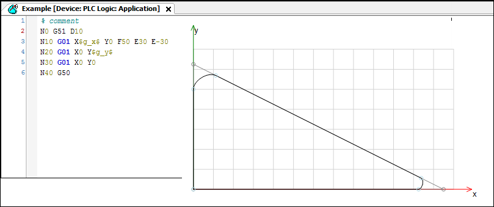
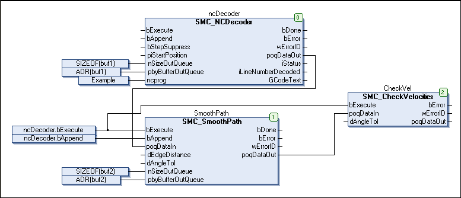

# CNC Example 03: Performing Path Preprocessing Online

See the `CNC03_prepro.project` sample project in the installation directory of CODESYS under `..\CODESYS SoftMotion\Examples`.

The example shows how path preprocessing can be performed online on the PLC.

Extend the `CNC02_online` project with one path preprocessor. Then the angles of the movement of the `CNConline` project are rounded by means of splines. This is done with the `SMC_SmoothPath` function block.

1. Extend the CNC program: Append the previous program with the elements `G51/G50`.

   Click [**CNC → Show preprocessed path**](_sm_cmd_cnc_show_preprocessed_path.html#_sm_cmd_cnc_show_preprocessed_path) so that the splines created by path preprocessing are displayed in the editor, as in the screenshot below.

   * Display:

     
2. Without using variables, you could compile the program in this form as a queue and enter it directly into the interpolator. However, as variables are available, you have to perform decoding and angle smoothing yourself.

   Declare a new function block of type `SMC_SmoothPath`. Call it after the decoder.

   Set the data input of the interpolator function block as usual to the `poqDataOut` output of the `CheckVelocities` function block.

   A new buffer has to be declared for the input `SMC_SmoothPath.pbyBufferOutQueue`.

   * CFC:

     

15.0

© Copyright 2026, CODESYS GmbH