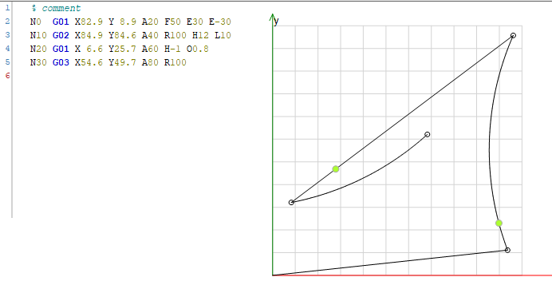

# Editing a CNC program in the editor

* Open the `CNC01_direct.project` project from the installation directory of CODESYS.
* In the project, open the CNC program `Example`.
* Add positions for the additional axis A to the travel commands:

  **CNC editor**

  ```
  N0  G01 X82.9 Y 8.9 A20 F50 E30 E-30
  N10 G02 X84.9 Y84.6 A40 R100 H12 L10
  N20 G01 X 6.6 Y25.7 A60 H-1 O0.8
  N30 G03 X54.6 Y49.7 A80 R100
  ```

  

15.0

© Copyright 2026, CODESYS GmbH