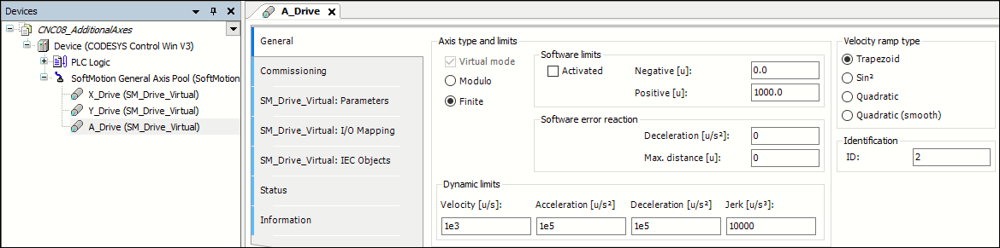

# Creating a drive interface and PLC configuration

* Insert an additional virtual drive **A\_Drive** below the **SoftMotion general axis pool**.
* Set the parameters as follows:

  

15.0

© Copyright 2026, CODESYS GmbH