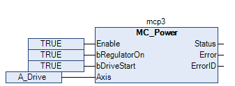
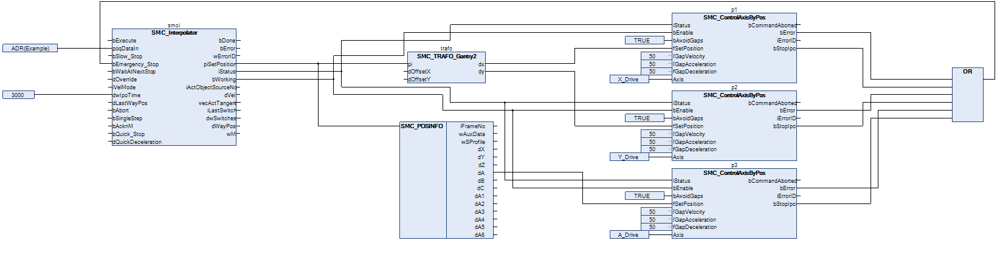

# Editing an IEC program

* Open the CFC program `Ipo`.
* Activate the previously added drive **A\_Drive** with the `MC_Power` function block.

  
* In this example, a simple orientation axis (**A\_Drive**) should be controlled with the additional axis A. For this reason, no more transformation modules are necessary. The set position of the interpolator corresponds directly to the set position of the drive and is applied via the `SMC_POSINFO` selector with the `SMC_ControlAxisByPos` function block. The application does not guarantee that the outputs of the interpolator are continuous. For example, the position of the additional axis ends at a different point than it begins. Therefore, you should activate the gap avoidance (`bAvoidGaps`, `fGapVelocity`, `fGapAcceleration`, and `fGapDeceleration`). Then connect the `bStopIpo` output to the `bEmergency_Stop` input of the interpolator and connect interpolator output `iStatus` to the respective inputs of the axis control function blocks.

  Above all, pay attention to the correct order of function blocks when programming with CFC.

  

15.0

© Copyright 2026, CODESYS GmbH