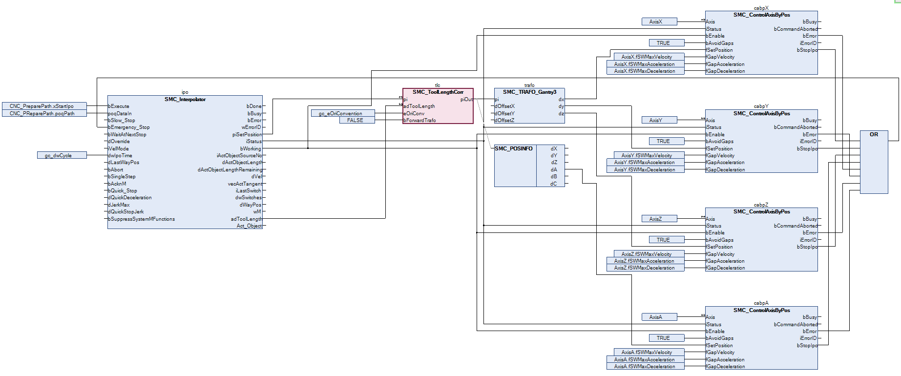

# Application

For the example, a Gantry3 kinematic is used together with an added orientation axis (`AxisA`) which can rotate about the Z axis. A tool with a length of 2 units in the Z direction is in turn attached to the orientation axis.

A simple CNC program should be run. This is stored in the project as an external `CNC.cnc` file and can be opened with a text editor. In the CNC program, the tool length correction is first activated by means of G code `G43`. The `I`, `J`, and `K` parameters correspond to the offset in the X, Y, and Z directions for this. Next, three points are traveled to in the XY plane. During the movement to the last point, the additional axis A is also rotated by 90 degrees.

```
N000 G43 I0 J0 K2 (Activate tool length correction with tool offset X=0 Y=0 Z=2)
N010 G01 X10 F10 E100 E-100
N020 G03 Y10 R5N030 G01 X0 A90
```

The application consists of multiple parts. In the `CNC_PreparePath` program, the CNC program `CNC.cnc` is imported as a file from the controller and preprocessed. In the `CNC` program, the drives are first switched on, as in the other examples. Then the interpolation of the previously read CNC program is performed. In each cycle, the interpolator outputs a set position `(piSetPosition`) and the current offset of the tool `(adToolLength`). The `SMC_ToolLengthCorr` POU requires this information to compensate the specified tool length. The compensated position is then transformed and finally passed to the axes by means of the `SMC_ControlAxisByPos` POUs.

TIP:

The program is almost identical to the other examples. Only the `SMC_ToolLengthCorr` POU has been inserted after the interpolator and before the transformation in order to process the set position output by the interpolator.



15.0

© Copyright 2026, CODESYS GmbH