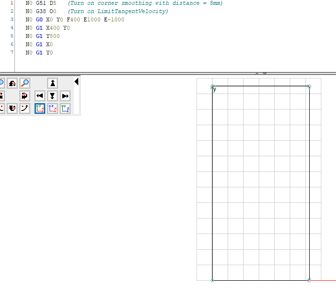
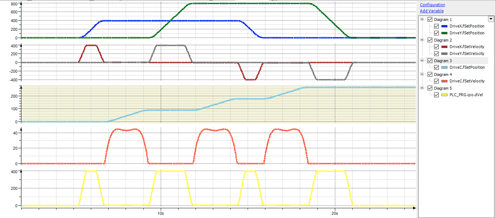

# Limiting the tangent change

The example shows a 2D cutting application. A knife should be used to cut along a path defined by G-code. The `SMC_TRAFO_GantryCutter2` transformation is used to determine the angle of the knife based on the current tangent of the path.

The challenge is that the knife must not rotate too quickly, otherwise the cut will not be clean. The limitation of the angular velocity of the knife is solved in the sample project by means of the newly created path-preprocessing function block `LimitTangentVelocity`. It changes the feed rate on the path so that the change velocity of the tangent does not exceed a configurable maximum value.

The G-code is a simple rectangle with smoothed corners.

The trace shows the result of the execution: The velocity of the C-axis, which corresponds to the rotational velocity of the knife, is displayed in orange. It is limited to 45°/s as specified.

15.0

© Copyright 2026, CODESYS GmbH