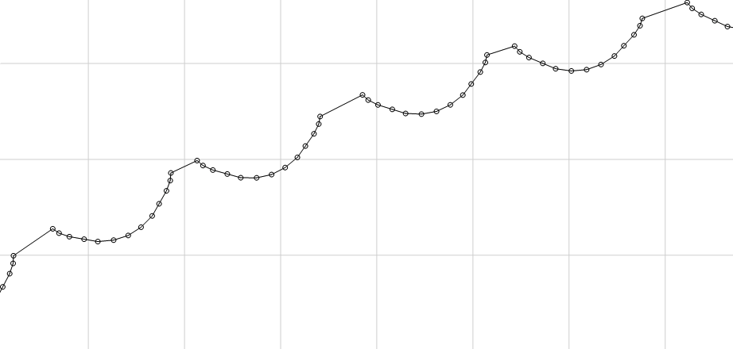
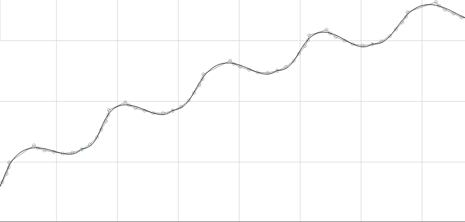
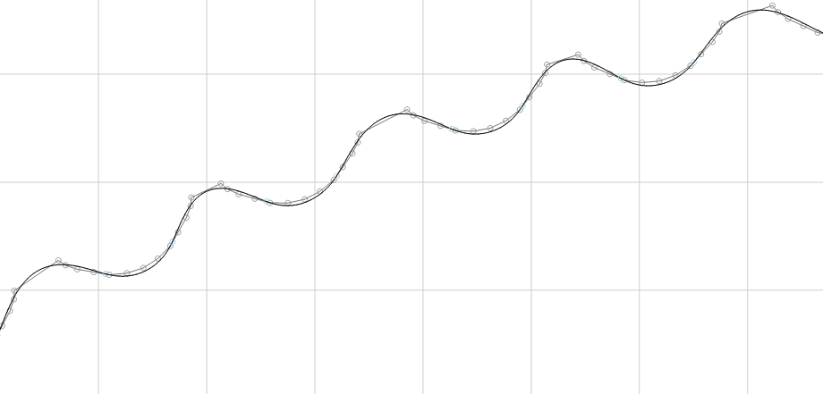

# Preprocessing of linear segments

The `SMC_SmoothMerge` function block ensures a smooth velocity curve on the many, very short linear segments. It combines as many consecutive linear segments as possible into one spline, while maintaining specified tolerances. In this example, a maximum deviation of 0.1 mm in X and Y is allowed (`PARAMETERS.piMaxDifference`).

The figures show the step-by-step processing:

* Reading the short linear segments

  
* Combining multiple linear segments into splines using `SMC_SmoothMerge`.

  
* Smoothing between the splines with `SMC_SmoothPath` because, as seen above, the splines do not connect tangentially to each other.

  

15.0

© Copyright 2026, CODESYS GmbH