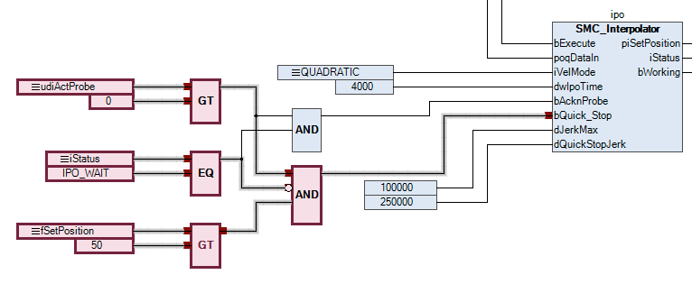
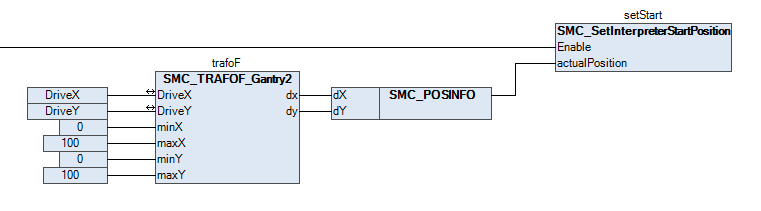
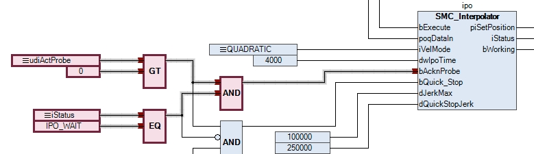
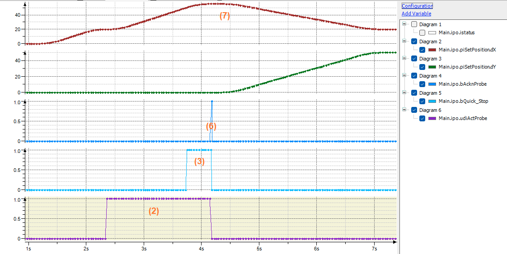

# Structure of the application

The structure is typical for CNC applications. The G-code is read in the background task (`PathTask`). Path preprocessing is also done in this task. The interpolation is performed in the bus task (`MainTask`).

The following G-code is used. In block `N10`, a rapid positioning is made to `X = 20`. Then, with G31 (probing function: clear remaining path) , a movement is made to `X = 100`. Finally, in block `N30`, a linear movement is made to `X = 20, Y = 50`.

```
N10 G0 X20 F100 E1000 E-1000
N20 G31 X100
N30 G1 X20 Y50
```

The interaction between the interpolator and the interpreter is particularly important for the probing function (clear remaining path).

* The interpreter decodes the G-code and generates a straight line from `X=20` to `X=100` for block `N20`. Then it stops decoding.
* The interpolator performs the linear movement and simultaneously outputs the probe number as output `udiActProbe`. For the G31, the sample number is always 1.
* In the application, the interpolator is stopped with `bQuick_Stop` as soon as the drive travels beyond position `X=50`. (This simulates the light barrier.)

  
* In the bus task, the `SMC_SetInterpreterStartPosition` function block is used to continuously copy the current position of the machine.

  
* In the `PathTask`, the start position is assigned to the input `SMC_NCInterpreter.piStartPosition`:

  ```
  inter(
      sentences:= read.sentences,
      bExecute:= read.bExecute,
      nSizeOutQueue:= SIZEOF(bufIpo),
      pbyBufferOutQueue:= ADR(bufIpo),
      piStartPosition:= Main.setStart.StartPos);
  ```
* As soon as the interpolator is stopped, the `bAcknProbe` input is used to acknowledge the G31 command. In a real application, it should also be checked at this point that the axes have actually reached the stop position. The SMC\_InPosition function block can be used to do this.

  
* This causes the interpreter to resume decoding, but with the updated start position so that the following block `N30` is started from position `X=55.5`.

The following diagram illustrates these steps. The numbers in brackets refer to the corresponding steps in the process outlined above.



15.0

© Copyright 2026, CODESYS GmbH