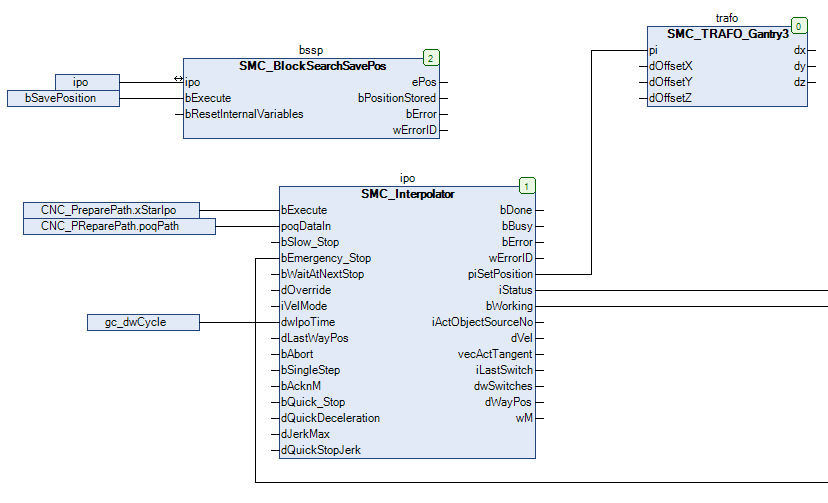

# Saving the preprocessing position

You can use the `SMC_BlockSearchSavePos` function block for saving the current position on command. At this time, the instance of the function block has to run in the task of the interpolator. The interpolator program in the example is named "CNC".

1. Declare an instance of the `SMC_BlockSearchSavePos` function block in the program that the interpolation performs.

   `bssp: SMC_BlockSearchSavePos;`
2. Connect the `bExecute` input to a control variable that is set in the application when the CNC program is canceled (for example if the `bAbort` input of the SMC\_Interpolator instance was set). The position stored at the `ePos` output is used as follows for the block search by means of `SMC_BlockSearc`. After interruption, `bExecute` has to be reset with a rising edge.

**Example**

Part of the program that performs the interpolation with the instance of the `SMC_BlockSearchSavePos` function block in CFC.

15.0

© Copyright 2026, CODESYS GmbH