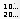

# Command: Renumber CNC Program

Symbol: 

**Function**: The command refreshes the numbering of program lines in the CNC program.

**Call**: **CNC** menu

**Requirement**: A CNC path is open in the editor.

The numbers start at 0 and are incremented by 10. Each block without a block number receives a number. L code in G20 blocks is corrected.

15.0

© Copyright 2026, CODESYS GmbH