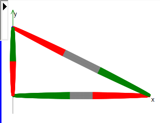

# Display in the graphical editor

An interpolation point is displayed with a line perpendicular to the direction of motion. The length of the line is proportional to the current path velocity. This makes it possible for a rough estimate of the behavior of the velocity.

|  |  |
| --- | --- |
| Larger distance and long line | High velocity |
| Smaller distance and short line | Low velocity |
| Red | The interpolator is decelerated. |
| Green | The interpolator is accelerated. |
| Gray | The interpolator has a constant velocity. |

15.0

© Copyright 2026, CODESYS GmbH