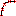

# Command: Show Interpolation Points

Symbol: 

**Function**: The command activates and deactivates the display of interpolation points.

**Call**: **CNC** menu

**Requirement**: A CNC path is open in the editor.

If the display of interpolation points is activated, then the CNC path is displayed with interpolation points.

The cycle time, which is set in the dialog of the CNC settings on the **[Preinterpolation](_sm_obj_cnc_settings.html#_sm_obj_cnc_settings)** tab is used to determine the interpolation points. In addition, this function determines whether or not a CNC path is displayed with preprocessing in the editor.

15.0

© Copyright 2026, CODESYS GmbH