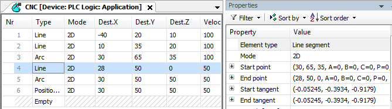

# Tabular Editor

In the tabular editor, the path commands are listed in a table. On the [Tabular Editor](9b41b11cdd1d3b028bf96605a0e02cbf.html#UUID-d9a82079-5340-fa0d-d359-dbb07184282a_section-idm43260108321858) tab, in the **CNC Settings**, you can customize the columns of this table. The **CNC Settings** are located as an object in the device tree.

By default, the properties of the selected path element are displayed on the right side of the table. These cannot be edited there.

When you select a line, the respective motion path is drawn in the graphical editor. The element type determines which specific properties of a path element can be changed. Non-editable parameters are shaded out. Pressing the **F6** key toggles the focus to the graphical editor and back.

For an overview of the elements supported by this editor, see the [Overview](_sm_f_reference_object_cnc_program.html#_sm_f_reference_object_cnc_program) chapter.

For more information, see: [Programming a Path in the Tabular Editor](_sm_cnc_programming_table_editor.html#_sm_cnc_programming_table_editor) and [Graphical Editor](_sm_obj_cnc_program_graphical.html#_sm_obj_cnc_program_graphical)

15.0

© Copyright 2026, CODESYS GmbH