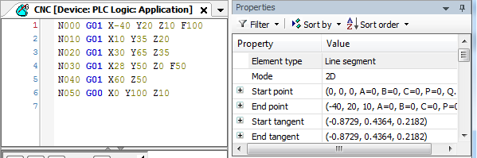

# Editor for DIN 66025

In this editor, you specify the path elements as a CNC program according to [DIN 66025](_sm_struct_reference_programming_din66025.html#_sm_struct_reference_programming_din66025). By default, the properties of the selected path element are displayed on the right side. However, they cannot be modified there.

When you select a line, the respective motion path is drawn in the graphical editor. Pressing the **F6** key toggles the focus to the graphical editor and back.

For an overview of the elements supported by this editor, see the [Overview](_sm_f_reference_object_cnc_program.html#_sm_f_reference_object_cnc_program) chapter.

IMPORTANT:

Note that references of global variables are evaluated in the decoder module when the interpreter is processing the blocks. This can happen a few cycles in advance before the object travels.

For more information, see: [Programming a Path according to DIN 66025](_sm_cnc_programming_DIN_66025.html#_sm_cnc_programming_DIN_66025) and [Object: CNC Settings](_sm_obj_cnc_settings.html#_sm_obj_cnc_settings)

15.0

© Copyright 2026, CODESYS GmbH