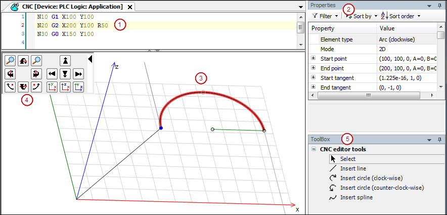

# Graphical Editor

The graphical editor is located in the lower part of the CNC tabular editor and the editor for DIN 66025. The editor is used to display the programmed CNC program.

The editor provides tools for modifying and extending the path.

**Structure of the editor**

* (1): Tabular editor or editor according to DIN 66025
* (2): Property view: Shows the properties of the selected path element
* (3): Graphical editor
* (4): Control panel: Elements for controlling the camera position and viewing direction
* (5): Tools for modifying the path

**Notes about working with the graphical editor**

* The selected path element is displayed in red.
* The positioning commands (G0) and switch point functions are displayed in green.
* If the end point of an element is movable, then it is displayed as a small black outlined circle.
* The start and end tangents are displayed in gray.
* The current position of the selected path element is displayed in the status bar.

TIP:

Note the CNC menu commands for scaling and moving the entire path.

Note the sample programs included in the installation of CODESYS SoftMotion.

15.0

© Copyright 2026, CODESYS GmbH