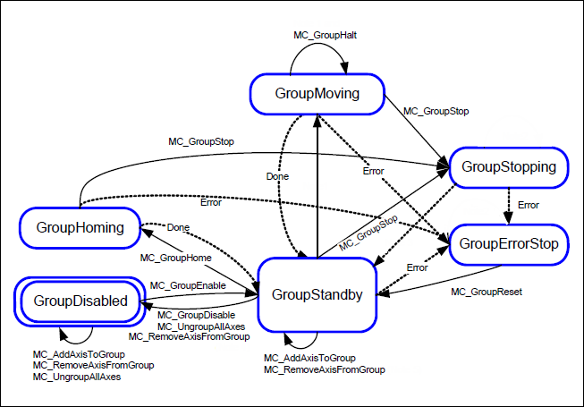

# Axis Group States

The image below shows the possible states for axis groups and the transitions between the states.

* The errors of individual axes always direct the axis group to the `GroupErrorStop` state.
* If the axis group switches to `GroupMoving`, then all axes are switched to `SynchronizedMotion`.
* If the axis group switches from `GroupMoving` to `GroupStandby`, then all axes are switched to `standstill`.
* If the axis group switches from `GroupMoving` to `GroupErrorStop`, then all axes are switched to `GroupErrorStop`.
* If the axis group is in `GroupStandby`, then the individual axes are not necessarily all in `standstill` because they can be controlled by means of single-axis motion function blocks such as `MC_Jog`.
* If motion is terminated with an error, then all buffered subsequent movements are aborted with `CommandAborted`.
* As long as the axis group follows a dynamic coordinate system, it will stay in `GroupMoving`.
* The axis group is in `GroupMoving` if and only if the group is moved in a coordinated manner (by one of the motion blocks from Part 4). Switching from `GroupMoving` to `GroupStandby` is done one cycle after the last position change.

15.0

© Copyright 2026, CODESYS GmbH