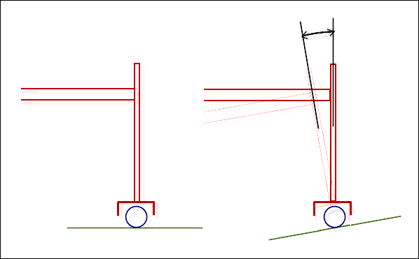

# Behavior when programming "impossible" orientations

In practice, it is often useful to be able to program orientations that are not available for the kinematics. As a simple example, consider a SCARA robot with a tool having one degree of freedom (rotation about the Z-axis). In principle, this robot can accept only orientations in which the tool points vertically downwards.

When positions should be traveled on a workpiece, it will be easily tilted from the X/Y-plane. The user teaches the workpiece and then programs the positions and orientations relative to the workpiece. The tilting of the workpiece results in orientations in which the tool direction is slightly tilted from the vertical.

How do we deal with such an impossible and unreachable orientation? A drastic measure would be to report a workspace violation. However, as the example shows, this would make programming tedious. Therefore, the orientation kinematics (`Kin_CAxis_Tool` in this example) are implemented in such a way that they assume the nearest achievable orientation. In this example this means that the commanded orientation is tilted in such a way that the tool stands upright and this orientation is accepted.

**The behavior can be reduced to the following rules (provided the position kinematics can position in all three spatial directions):**

* The position is always approached exactly (otherwise an error is reported).
* The orientation is "projected" to the nearest accessible one if it cannot be reached.
* When projecting the orientation, the tool direction has priority.

The difficulties described here arise because the orientation kinematics do not have the three degrees of freedom to achieve all desired orientations. This is the case with `Kin_Wrist2` and `Kin_CAxis`, but not with `Kin_Wrist3`.

Additional difficulties arise when the position kinematics also do not have all spatial degrees of freedom. (This does not occur often in practice.) One example is the combination of `Kin_Gantry2`, a gantry that can be positioned in X/Y only, and with `Kin_Wrist2`, a tool with only two degrees of freedom. In this case, there are impossible orientations as well as impossible positions, because the Z-coordinate is already defined by the tool length and the position of the orientation axis. Therefore, we recommend that you do not use these kinds of combinations, but to program only attainable positions.

15.0

© Copyright 2026, CODESYS GmbH