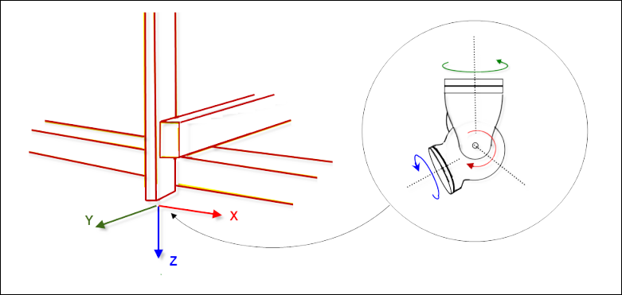

# Combination of Position and Orientation Kinematics

With the axis group configurator, you can combine position kinematics and orientation kinematics. As a result, a large number of robots can be configured with a small number of kinematics.

Examples of position kinematics include gantries (`Kin_Gantry3`) and tripods (`Kin_Tripod_Lin`, `Kin_Tripod_Rotary`). These kinematics can travel to any point or position, but cannot perform any number of orientations. The front coordinate system of a position kinematic system is referred to as a flange coordinate system. It defines the place where orientation kinematics are attached (figure on left).

Examples of orientation kinematics are `Kin_CAxis`, `Kin_Wrist2`, and `Kin_Wrist3`. These kinematics can result in a desired orientation of the TCP, but cannot reach any position (see figure on the right).

By combining both position kinematics and orientation kinematics, it is possible to travel any number of positions in the desired orientation, or the other way around.

15.0

© Copyright 2026, CODESYS GmbH