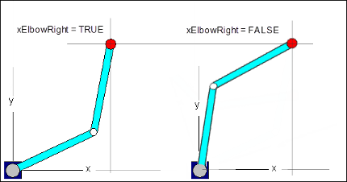

# Kinematic Configurations

A kinematic configuration describes the layout of the axes in an axis group to one another. Depending on the kinematics, several configurations are possible for the same TCP position.

For example, two possible configurations are shown for SCARA 2.

The axis group has an active configuration that does not necessarily have to correspond to the current axis positions. If a movement is commanded, then the target position may be converted into axis coordinates. The configuration that is active at the time of commanding is used.

This active configuration can be set with the function block `SMC_SetKinConfiguration`. During initialization and each time the kinematics are changed, the axis group applies the standard configuration. All kinematics with a configuration has a standard configuration.

TIP:

A CP movement between two configurations is not possible. In this case, the positioning has to be done by means of a PTP movement.

TIP:

The current configuration can be determined with the function block `MC_GroupReadActualPosition`.

15.0

© Copyright 2026, CODESYS GmbH