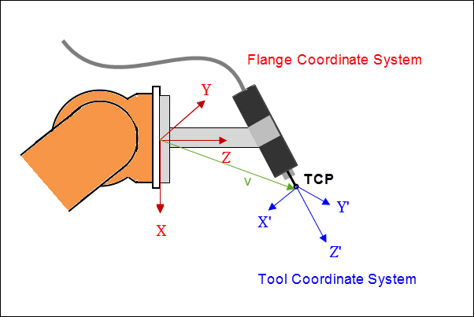

# Configuring a Tool Offset

You can set the offset between the flange coordinate system of the kinematics (XYZ) and the TCP coordinate system of the kinematics (X'Y'Z') by means of configuring a tool offset. This tool offset acts on all subsequent movements.

TCP: Tool Center Point

The tool offset is specified by a shift `v=(x,y,z)` and a rotation `r=(A,B,C)` in ZYZ Euler angles. Shift and rotation are expressed relative to the flange coordinate system of the kinematics.

When you configure a tool offset, it can be incompatible with the current kinematics. As a result, a tool offset can cause the kinematics to be incapable of achieving orientations. In this situation, an error is issued and the tool offset is ignored. For example, you can configure a tool offset in the Z-direction for the kinematics `Kin_Scara2_Z`. On the other hand, an offset with parts in the X- or Y-direction results in an error. When kinematics have these kinds of restrictions, they are described with the [kinematics](_sm_robotics_cds_sm_kinematics.html#_sm_robotics_cds_sm_kinematics).

15.0

© Copyright 2026, CODESYS GmbH