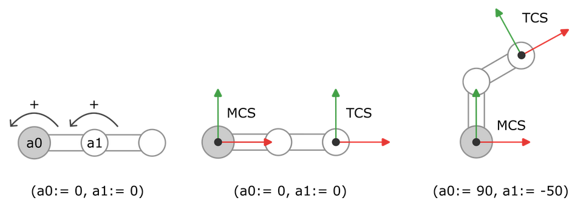

# Kinematics

The kinematics define the zero position of the robot (as shown below). The origin of the machine coordinate system lies on the axis of rotation of axis `a0`. The X-axis points in the direction of the first link when the position of the first axis `a0` is `0`. The Y-axis points in the direction of the first link when the position of the first axis `a0` is `+90°`. Counterclockwise rotation corresponds to the positive direction of rotation. The tool center point (TCP) lies at the end of the second link of the robot (as shown below) and forms the origin of the TCS. The TCS is aligned in such a way that the X-axis runs along the second link.

15.0

© Copyright 2026, CODESYS GmbH