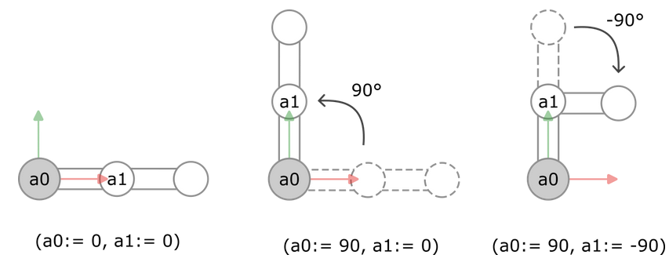

# Axis Coordinate System (ACS)

The kinematics have specified the zero position of the robot and the direction of rotation of the individual axes. Because the robot consists of two axes `a0` and `a1`, we can specify the positions of axes `a0` and `a1` in the ACS.

In the first image, we specify the position (`a0:= 0, a1:= 0`). This corresponds to the zero position of the robot.

In the second image, we specify the position (`a0:= 90, a1:= 0`). Starting from the zero position, the first axis `a0` is rotated `90°` in the positive direction of rotation. The second axis `a1` remains in the zero position.

In the third image, we specify the position (`a0:= 90, a1:= -90`). Starting from the zero position, the first axis `a0` is rotated `90°` in the positive direction of rotation (as in the second image). In addition, the second axis `a1` is rotated `90°` in the negative direction of rotation.

15.0

© Copyright 2026, CODESYS GmbH