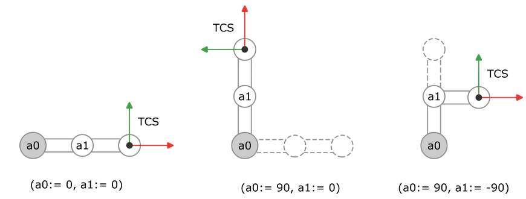

# Tool Coordinate System (TCS)

The kinematics define the position and orientation of the TCP and TCS. Depending on how we move the robot, the position and orientation of the TCS also changes.

15.0

© Copyright 2026, CODESYS GmbH