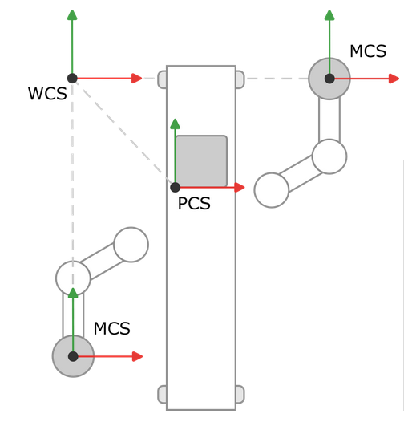

# World Coordinate System (WCS), Machine Coordinate System (MCS), and Product Coordinate System (PCS\_1, PCS\_2)

In a production hall, two robots stand to the left and right of a conveyor belt. The robots should process products on the conveyor belt. We define a common world coordinate system and place it in the top left-hand corner of our production hall. Starting from this coordinate system, we determine the distance and rotation to the machine coordinate systems and the product and shift the coordinate systems accordingly.

In the example, all coordinate systems are aligned in the same way so that we only need to shift the coordinate systems. The machine coordinate system of the left robot is shifted in the Y-direction, the machine coordinate system of the right robot is shifted in the X-direction, and the product coordinate system is shifted in both the X-direction and Y-direction.

15.0

© Copyright 2026, CODESYS GmbH