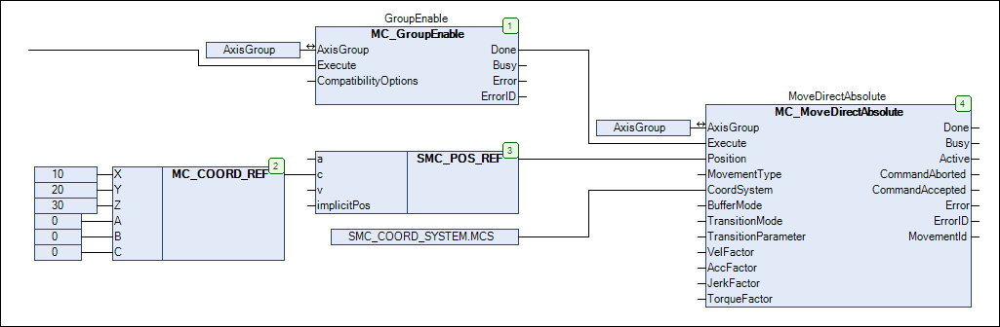

# How to Create a Program for Controlling the Axis Group

The following instructions describe how to create a program for controlling an axis group.

**Requirement**: A project has been created with an axis group, as specified in the [How to Create an Axis Group](_sm_creating_an_axis_group.html#_sm_creating_an_axis_group) chapter.

The program for controlling an axis group is created in the `PLC_PRG` POU with CFC as the implementation language.

1. Open the `PLC_PRG` program in the editor.
2. Extend the program as follows:

   

   **Explanation:**

   * The `MC_MoveDirectAbsolute` function block commands a PTP motion of the **AxisGroup** axis group.
   * In the example, the kinematics are moved to the position (X = 10, Y= 20, Z = 30). This value is mapped to the `Position` input via the `SMC_POS_REF` structure.
   * The position is specified in the machine coordinate system (MCS). The coordinate system is selected by means of the `CoordSystem` input.

15.0

© Copyright 2026, CODESYS GmbH