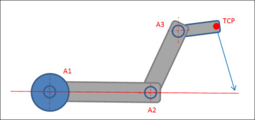
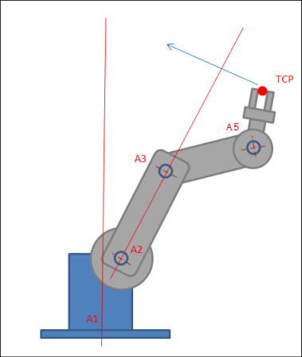

# Singularities in axis orientation interpolation

With axis orientation interpolation, a path movement can take place through the singularities of the orientation kinematics, which can make the programming significantly easier. The singularities of the position kinematics change for this purpose.

In the case of large circular interpolation, Scara3\_Z has a singularity if the flange point (A3) is located on the straight line defined by the first arm part (if the second joint angle is 0°).

For axis orientation interpolation, the singularities of the position kinematics change so that the TCP takes on the role that the flange point (A3) has otherwise. This singularity occurs when the TCP (not the flange point) is located on the straight line defined by the first arm part. When commanding a movement with axis orientation interpolation, it is checked whether or not this changed singularity is located between the start and target positions of the movement. If so, then the movement is not accepted and an error is issued.

For 6-axis articulated arm robots, the situation is comparable to Scara3\_Z, but two singularities are possible. The first occurs when the TCP is located on the straight line through A2 and A3. The second occurs when the TCP is located on the line through A1. The commanding also checks here that no singularity is traveled through.

TIP:

It can happen that the configuration of Scara3 (or the 6-axis articulated arm robot) changes when traveling with axis orientation interpolation. However, at the end of the movement the same configuration that the robot had at the starting point is always applied.

15.0

© Copyright 2026, CODESYS GmbH