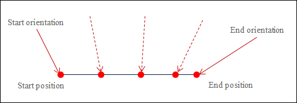

# Orientation Interpolation for CP Movements

In the case of CP movements such as `MC_MoveLinearAbsolute`, `MC_MoveLinearRelative`, `MC_MoveCircularAbsolute`, or `MC_MoveCircularRelative`, any target orientation of the tool can be specified by means of the target position of the movement. The consequence is that the orientation of the tool is converted to the target orientation during the path movement with the tip of the tool traveling on the path. For the orientation interpolation, it does not make any difference in which coordinate system the target orientation was given, either in axis coordinates (ACS) or machine coordinates (MCS).

The following image shows a linear interpolation with the simultaneous orientation interpolation. The red arrow indicates the direction of the tool at the start and end points. The dashed red line indicates how the tool is positioned at some locations during interpolation.

**The function blocks mentioned above for path movements have the `OrientationMode` input. This input defines how the start orientation is passed to the target orientation.**

* Great circle interpolation (`SMC_Orientation_Mode.GreatCircle`)

  This is a default setting. With this setting, the start orientation is also passed to the target orientation in the shortest distance. The shortest distance means that the tool is rotated in the target orientation so that the traveled angle of the rotation is minimized.
* Axis orientation interpolation (`SMC_Orientation_Mode.Axis`)

**Example 1: Great circle interpolation**

Consider a gantry having a C-axis with a value range of -360° to 360°. The start orientation is C=179°, and the target orientation is C=-175°. The great circle interpolation moves the C-axis of the ZYZ Euler angle (A,B,C) proportionally to the traveled distance on the path from 179° in the positive direction past 180° to 185°, which corresponds to -175°. In this case, it travels a total angle of 6°.

**Example 2: Axis orientation interpolation**

Consider again the gantry having a C-axis with a value range of -180° to 180°. The start orientation is C=179°, and the target orientation is C=-175°. The axis interpolation moves the C-axis of the gantry proportionally to the traveled distance on the path from 179° in the negative direction past 0° to -175°, traveling a total angle of 354°. (If the great circle interpolation was used in this example, then an error would have occurred, because the workspace of the C axis would have been exceeded.)

**These two types of interpolation differ in some important characteristics.**

* In great circle interpolation, the change in the orientation of the tool can be predicted. In the axis interpolation, it is difficult to predict the change in orientation, because the orientation axes can affect the orientation differently depending on the position. The axis orientation interpolation shares this characteristic with PTP movements. (However, this does not mean that it is difficult to predict the path in space for axis orientation interpolation. The path is the same for both types of orientation interpolation, and the TCP always travels the defined contour exactly.)
* With great circle interpolation, singularities in the orientation kinematics cannot be traveled. This is easily possible with axis interpolation.
* In great circle interpolation, violations to the axis limits of the orientation axes can result, as mentioned in the second example. When commanding, it is therefore required to make sure that no axis limits are violated when traveling to the target orientation with the shortest rotation.
* With axis interpolation, it is possible to rotate more than 360°. If an orientation axis has a workspace of more than 360°, then you can travel to position 540°, for example, instead of to position 180°. This corresponds to the same orientation of the tool. With great circle interpolation, this is not possible. The shortest rotation to the target orientation always corresponds to a total angle of 180° at most.
* The axis orientation interpolation requires coupled kinematics that consist of position and tool kinematics. The position part has to implement the interface `ISMPositionKinematics_Offset2`.
* If the kinematics do not have any rotary axes and they implement the interface `ISMPositionKinematics`, then the selected orientation mode (`SMC_Orientation_Mode`) is ignored.

15.0

© Copyright 2026, CODESYS GmbH