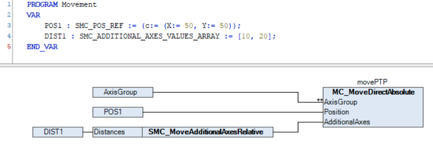

# Commanding additional axis movements

When commanding additional axis movements, you can always choose between absolute and relative movements, regardless of whether the main movement of the axis group is absolute or relative. For example, a relative additional axis movement can be commanded synchronously with an `MC_MoveLinearAbsolute` command.

Additional axis movements are commanded via the `AdditionalAxes` input of the motion function blocks for the axis group. For example, an absolute PTP movement with a relative additional axis movement can be commanded as follows:

If only the additional axes should be moved, then a coordinated movement of length 0 (for example, `MC_MoveDirectRelative` with distance `0`) can be commanded together with an additional axis movement.

15.0

© Copyright 2026, CODESYS GmbH