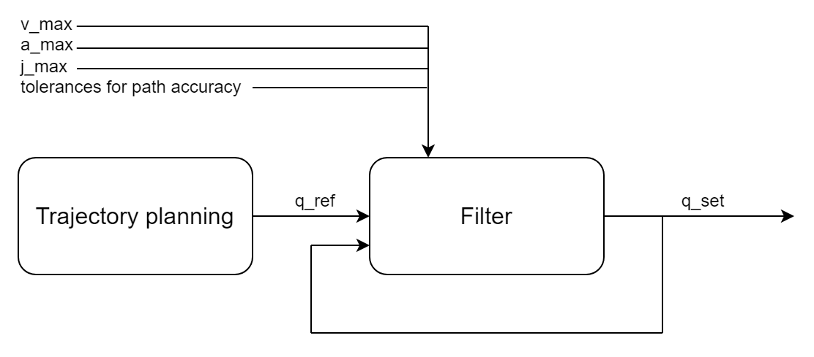

# Overview

Why are tolerances necessary for path accuracy? Ideally, the axis group should follow the path exactly. However, if a dynamic coordinate system is used (for example, an object on a belt or rotary table, or a coordinate system specified by another axis group), then in some cases it is not possible to follow the path.

Example: A robot should place a part on a conveyor belt. The belt moves at a constant velocity, but just before the robot reaches the position to place the part, the belt accelerates unexpectedly. In this situation, the trajectory for placing the part has already been calculated, but with the assumption that the belt continues to move at a constant velocity. Therefore, the remaining movement may now lead to a violation of the maximum acceleration of one of the axes of the robot.

In situations like this, the tolerances are important. They allow the axis group to deviate from the path within the specified limits and catch up with the coordinate system again.

The path accuracy is controlled by a filter. The filter receives the planned trajectory (`q_ref`) and the last calculated target positions (`q_set`) as input. The output of the filter are the target positions (`q_set`), which are transferred to the drives. If `q_ref` violates one of the axis limits, then the filter leaves the path and follows the planned trajectory as closely as possible without violating an axis limit. As long as the lag between `q_set` and `q_ref` is within the tolerances, no error is output.

**The tolerances for the path accuracy consist of several values:**

* Maximum lag of the TCP in technical units (default value: `1 u`)
* Maximum orientation error of the TCP in angular degrees (default value: `1 deg`)
* Maximum allowed lag of each axis in technical units of the axis (default value: infinity)

15.0

© Copyright 2026, CODESYS GmbH